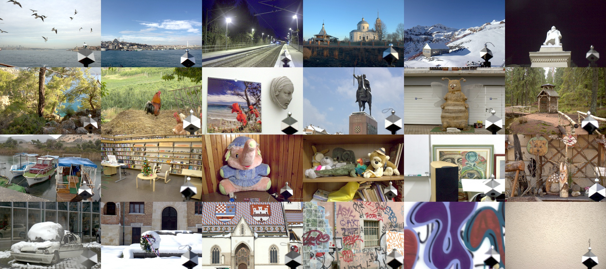

# Cube++


<!-- Front pic:
07_0405 07_0276 12_0444 15_1441 08_9943 05_9539
04_9616 00_0368 00_2855 00_0501 00_0177 02_8504
04_9457 02_8337 05_9565 03_9187 00_1005 00_1638
00_0021 00_1628 00_1001 20_2821 21_4445 01_7860 -->

Cube++ is a novel dataset for the color constancy problem that continues on the [Cube+ dataset](https://ipg.fer.hr/ipg/resources/color_constancy). It includes 4890 images of different scenes under various conditions. For calculating the ground truth illumination, a calibration object with known surface colors was placed in every scene. The Cube++ dataset was used in [ICMV 2020 2nd Illumination Estimation Challenge](http://chromaticity.iitp.ru/).

# Download
Data is avalilable on zenodo.org and the FTP mirror under [CC BY 4.0](https://creativecommons.org/licenses/by/4.0/) license. 
* [Cube++](https://zenodo.org/record/4153431) (200GB, 4890 images) with [PNG0](https://yadi.sk/d/OrIkFq2yYQKJ3Q) can be downloaded with the following commands 
```bash
pip install zenodo-get
zenodo_get https://zenodo.org/record/4153431 --output-dir=Cube++
cd Cube++/
wget https://storage.yandexcloud.net/cubepng0/PNG0.zip
```
* [SimpleCube++](https://zenodo.org/record/4153431/files/SimpleCube%2B%2B.zip) (2GB, 2234 images) 
```bash
wget https://zenodo.org/record/4153431/files/SimpleCube++.zip
```
* FTP mirror [ftp://vis.iitp.ru/Cube++](ftp://vis.iitp.ru/Cube++) 


# Description
* 4890 raw camera images
* 200GB of raw and preprocessed data
* Manual annotations and metadata
* Various scene illuminations
* 2GB SimpleCube++ subdataset

## Cube++
Images were obtained with sensors of same type on Canon 550D and Canon 600D cameras. As a calibration tool, SpyderCube was used due to its ability to identify multiple illumination sources from different angles. The dataset includes:
* **PNG/{img_id}.png** – 16-bit PNG images
* **gt.csv** – Ground truth chromaticities answers. Ground truth file. The table contains automatically calculated ground truth values. The columns are: image and for each of the 4 triangles (left, right, left bottom, right bottom) it contains three columns r, g, b with the corresponding RGB illumination estimation. The illumination estimation is normalized so that `r + g + b = 1`
* **properties.csv** – Annotation and metadata file. The table contains the most relevant meta information of the dataset images. It includes the average triangle brightness, manually labeled properties, selected EXIF fields
* **JPG/{img_id}.jpg** – JPEG images, for visualization purposes only
* **auxiliary/**
    * **extra/**
        * **exif/{img_id}.json** – All the extracted EXIF data
        * **gt_json/{img_id}.json** – Calculated gts, all the data is duplicated in gt.csv or properties csv
        * **cam_estimation.csv** – Selected EXIF estimations made by camera
        * **exif_stat.csv** – EXIF fields statistics
    * **source/** – the dataset is automatically build from this directory
        * **CR2/{img_id}.CR2** – Original raw CR2 images
        * **JPG.JSON/{img_id}.jpg.json** – JSON markup files. Each file contains manually labeled features and cube coordinates
        * **full_estimation.csv** – extra markup file for full estimation or partial estimation

See also a more [detailed description](./description/description.md).

## SimpleCube++

In addition to the main Cube++ dataset, small and simpler version of it is prepared. Simple dataset contains 4x downscaled images that have less than 1° difference between left and right ground truth illumination estimation. It includes only 2234 images with single source illumination; consequently, there is only one ground truth per image. The simple dataset weights around 2GB.

Small dataset contains PNG and JPG files, gt.csv with ground truth data and properties.csv with manual annotation data:
* **train**
    * **PNG/{img_id}.png** – 16-bit PNG images with cropped cube area
    * **gt.csv** – Ground truth chromaticities answers. Ground truth file. The table contains automatically calculated ground truth values. The columns are: image (contains image id) and three columns r, g, b with the corresponding RGB illumination estimation. The illumination estimation is normalized so that `r + g + b = 1`
* **test** – The same format
    * **PNG/{img_id}.png**
    * **gt.csv**
* **auxiliary**
    * **{test/train}_properties.csv** – Annotation and metadata file. The table contains the most relevant meta information of the dataset images. It includes image column (contains image id), ds_version (0.0 for Cube images; 1.0 for Cube+ extension and IEC2019 test images; 2.0 for Cube++ extension), manually labeled properties (only daytime; place; illumination; is_sharp; shadows)
    * **JPG/{test/train}_{img_id}.jpg** – JPEG images with cropped cube area, for visualization purposes only

See also a more [detailed description](./description/description.md#simplecube).

# Papers
If you use the dataset in your research, please refer to the following paper:
* [The Cube++ Illumination Estimation Dataset](https://arxiv.org/abs/2011.10028).
```
@article{ershov2020cube++,
  title={The Cube++ Illumination Estimation Dataset},
  author={Ershov, Egor and Savchik, Alex and Semenkov, Illya and Bani{\'c}, Nikola and Belokopytov, Alexander and Senshina, Daria and Koscevi{\'c}, Karlo and Suba{\v{s}}i{\'c}, Marko and Lon{\v{c}}ari{\'c}, Sven},
  journal={arXiv preprint arXiv:2011.10028},
  year={2020}
}
```
* [Problems of dataset creation for light source estimation](https://arxiv.org/abs/2006.02692).
```
@article{ershov2020problems,
  title={Problems of dataset creation for light source estimation},
  author={Ershov, Egor and Belokopytov, Alexander and Savchik, Alex},
  journal={arXiv preprint arXiv:2006.02692},
  year={2020}
}
```
